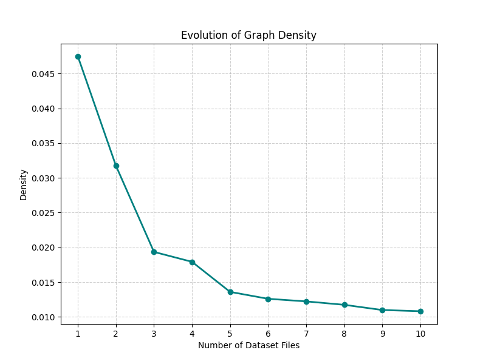
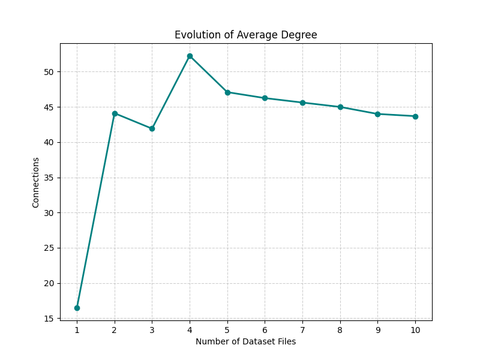
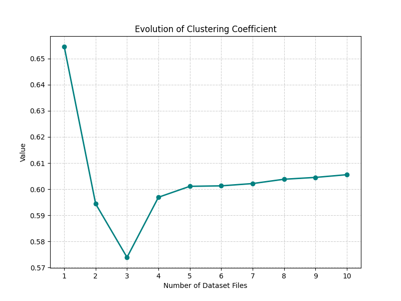
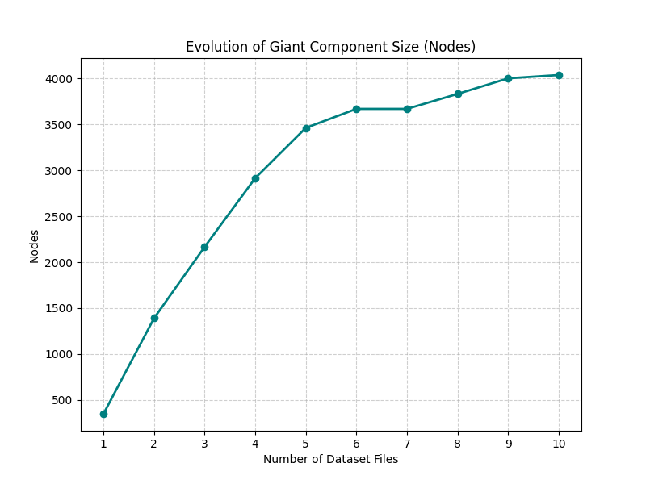
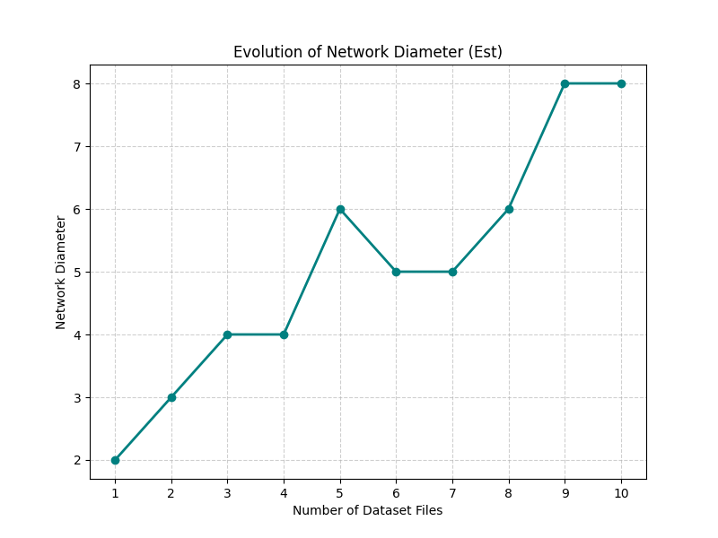
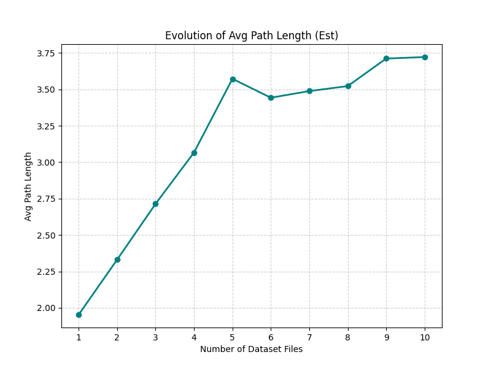

## Analysis: Connected Components and Traversals (3.1.1cca)

### Overview

**What are we doing?**
We analyze the runtime behaviour, invariance properties, and connectivity metrics for four fundamental graph algorithms: Breadth-First Search (BFS), Depth-First Search (DFS), Union-Find by Rank (UFA-Rank), and Union-Find by Size (UFA-Size). These algorithms are applied to the SNAP-EGO Facebook social network datasets.

**Practical Relevance**
These algorithms are foundational for network analysis, social graph processing, and systems problems including connectivity discovery, component labelling, shortest-path layering, and dynamic connectivity. Understanding their empirical performance on real network data enables optimal algorithm selection for larger pipelines (community detection, epidemic modelling, influence propagation).

**Methodology**
Results are obtained through timed runs on real-world ego-network graph files. All measurements, plots, and detailed analysis are available in `3.1.1cca/analysis/` and `3.1.1cca/plots/` directories.

---

## Algorithms Implemented

1. **Breadth-First Search (BFS)** - Level-by-level graph traversal
2. **Depth-First Search (DFS)** - Depth-first recursive graph traversal  
3. **Union-Find by Rank (UFA-Rank)** - Disjoint set with rank heuristic
4. **Union-Find by Size (UFA-Size)** - Disjoint set with size heuristic

---

## 1. Breadth-First Search (BFS)

### Algorithm Description

**Background:** BFS is a fundamental graph traversal algorithm first formalized for computing shortest paths in unweighted graphs. It systematically explores vertices level-by-level from a source node using a FIFO queue.

**Correctness:** BFS guarantees that nodes are visited in non-decreasing order of distance from the source. The FIFO queue ensures the first time a node is reached represents the shortest path in an unweighted graph.

### Complexity Analysis

**Theoretical Complexity:**

**Time:** $O(V + E)$
- Each vertex is enqueued/dequeued exactly once: $O(V)$
- Each edge is examined at most twice (once per endpoint): $O(E)$
- Total: $O(V + E)$

**Space:** $O(V)$
- Queue storage: $O(V)$ in worst case (star graph)
- Visited set/array: $O(V)$
- Level tracking: $O(V)$

### Empirical Performance

#### Complexity Grid (Runtime vs Graph Size)

**Graph Description:** This plot shows BFS execution time versus the combined input size (V+E) across 10 dataset steps ranging from 348 nodes to 4,039 nodes.

**Interpretation:** The plot exhibits a clear linear trend confirming the theoretical $O(V+E)$ complexity. The growth rate is consistent across small (348 nodes) to medium-large (4,039 nodes) graphs. Minor deviations from perfect linearity are due to cache effects and system noise.

**Key Observations:**
- Linear scaling confirmed: doubling V+E approximately doubles runtime
- No superlinear growth detected
- Execution times range from 0.0016s (smallest) to 0.0504s (largest)

#### Start-Node Invariance

**Graph Description:** Statistical summary of BFS runtime variation when starting from different nodes in the same graph. Metrics include mean, standard deviation, and coefficient of variation.

**Interpretation:** The low coefficient of variation (18.90%) demonstrates that BFS performance is relatively independent of start node selection. This is expected because BFS explores the entire connected component regardless of entry point.

**Key Observations:**
- Mean runtime: 0.02703s
- Standard deviation: 0.00511s  
- Coefficient of variation: 18.90% (acceptable variance)
- Performance is reasonably consistent across different start nodes

#### Order Invariance

**Graph Description:** Comparison of BFS runtime on normal (original adjacency list order) vs shuffled (randomized adjacency list order) edge orderings.

**Interpretation:** The small difference (0.00403s) between normal and shuffled orderings indicates BFS is relatively insensitive to adjacency list order. However, the slight increase with shuffling suggests cache locality benefits from the original ordering.

**Key Observations:**
- Normal ordering: 0.02170s
- Shuffled ordering: 0.02573s
- Difference: 0.00403s (18.6% increase)
- Cache effects visible but not dominant

### Measured Performance Data

*Raw performance data available in: `data/bfs_performance.csv`*

### Strengths, Weaknesses, and Use Cases

**Strengths:**
- Simple, intuitive implementation
- Guaranteed shortest paths in unweighted graphs
- Optimal $O(V+E)$ time complexity
- Low memory overhead for sparse graphs
- Predictable performance characteristics

**Weaknesses:**
- Memory-intensive for very dense graphs (large queue)
- Not suitable for weighted shortest paths
- Full-graph exploration may be wasteful if target is near source
- Queue overhead can impact cache performance

**Ideal Use Cases:**
- Connected component discovery
- Shortest path in unweighted graphs
- Level-order network analysis
- Social network distance computation
- Web crawling with bounded depth

---

## 2. Depth-First Search (DFS)

### Algorithm Description

**Background:** DFS is a fundamental traversal that explores as deeply as possible along each branch before backtracking. It's widely used for structural graph properties, ordering, and cycle detection. The algorithm uses either recursion or an explicit stack to track the exploration path.

**Correctness:** DFS visits every reachable vertex exactly once. The recursion/stack mechanism ensures complete exploration: when all neighbors are processed, control returns to the previous vertex, guaranteeing eventual completion.

### Complexity Analysis

**Theoretical Complexity:**

**Time:** $O(V + E)$
- Each vertex is visited once: $O(V)$
- Each edge is examined at most twice: $O(E)$
- Total: $O(V + E)$

**Space:** $O(V)$
- Recursion stack depth: $O(V)$ worst case (path graph)
- Visited set/array: $O(V)$
- For iterative implementation: explicit stack $O(V)$

### Empirical Performance

#### Complexity Grid (Runtime vs Graph Size)

**Graph Description:** This plot displays DFS execution time as a function of graph size (V+E) across the 10-step dataset progression.

**Interpretation:** DFS exhibits linear scaling nearly identical to BFS, confirming $O(V+E)$ complexity. The consistent linear trend across all graph sizes demonstrates efficient implementation with minimal overhead.

**Key Observations:**
- Linear relationship between runtime and V+E
- Performance comparable to BFS (sometimes slightly faster, sometimes slower)
- No evidence of quadratic or superlinear behavior
- Execution times: 0.0018s (smallest) to 0.0326s (largest)

#### Start-Node Invariance

**Graph Description:** Statistical analysis of DFS runtime variability across different starting nodes.

**Interpretation:** DFS shows even lower variance (15.34%) than BFS (18.90%), indicating highly consistent performance regardless of start node. The recursion pattern and depth-first nature lead to predictable execution paths.

**Key Observations:**
- Mean runtime: 0.02575s
- Standard deviation: 0.00395s
- Coefficient of variation: 15.34% (better than BFS)
- More stable than BFS across different start points

#### Order Invariance

**Graph Description:** Comparison of DFS performance between original and shuffled adjacency list orderings.

**Interpretation:** DFS shows exceptional order invariance with only 0.00013s difference (0.6% change). This minimal sensitivity suggests DFS is highly robust to edge ordering, likely due to depth-first exploration reducing cache sensitivity.

**Key Observations:**
- Normal ordering: 0.02130s
- Shuffled ordering: 0.02117s
- Difference: 0.00013s (0.6% change)
- Essentially order-independent
- Better order invariance than BFS

### Measured Performance Data

*Raw performance data available in: `data/dfs_performance.csv`*

### Strengths, Weaknesses, and Use Cases

**Strengths:**
- Minimal implementation complexity
- Natural recursive implementation
- Excellent for structural analysis (cycles, ordering)
- Better cache locality than BFS in some cases
- Superior order invariance
- Low constant factors

**Weaknesses:**
- Recursion depth limitations (can overflow stack on deep graphs)
- Does not find shortest paths
- May explore very deep before exploring nearby nodes
- Not suitable for shortest-path queries

**Ideal Use Cases:**
- Topological sorting
- Cycle detection
- Connected component labelling
- Maze solving
- Dependency resolution
- Tree/forest traversal

---

## 3. Union-Find (Disjoint Set Union)

We analyze both Union by Rank and Union by Size together as they implement the same abstraction with minor heuristic differences.

### Algorithm Description

**Background:** Union-Find (Disjoint Set Union, DSU) is a data structure for maintaining a partition of elements under union and find operations. With path compression and union heuristics, it achieves near-constant time per operation. This structure dates to early work on Kruskal's MST and dynamic connectivity algorithms.

**How it Works:**
- Each element has a parent pointer; roots represent set representatives
### Algorithm Description

**Background:** Union-Find (Disjoint Set Union, DSU) is a data structure for maintaining a partition of elements under union and find operations. With path compression and union heuristics (rank or size), it achieves near-constant time per operation. This structure dates to early work on Kruskal's MST and dynamic connectivity algorithms. Each element has a parent pointer with roots representing set representatives. The **find** operation follows parent pointers to the root while applying path compression to flatten the tree. **Union by Rank** attaches the tree with smaller rank under the tree with larger rank, while **Union by Size** attaches the tree with fewer nodes under the tree with more nodes.

**Correctness:** The structure maintains valid partitions with these invariants: every element's parent chain leads to a root, roots uniquely represent disjoint sets, union correctly merges two sets by linking roots, and path compression preserves set membership while improving performance.
- $\alpha(n)$ is the inverse Ackermann function
- For all practical values ($n \leq 10^{80}$): $\alpha(n) \leq 4$
- Effective complexity: $O(m)$ (nearly linear)
- For graph connectivity: $O(E \cdot \alpha(V))$ ≈ $O(E)$

**The Inverse Ackermann Function ($\alpha$):**
The inverse Ackermann function grows extraordinarily slowly:
- $\alpha(1) = 1$
- $\alpha(10) = 2$
- $\alpha(1000) = 3$
- $\alpha(10^{80}) = 4$ (exceeds atoms in universe)

This means Union-Find achieves virtually constant-time operations in practice.

**Space:** $O(V)$
- Parent array: $O(V)$
- Rank/Size array: $O(V)$

### Empirical Performance

#### Complexity Grid - Union by Rank

**Graph Description:** Runtime of Union-Find by Rank versus graph size (V+E).

**Interpretation:** UFA-Rank shows near-linear scaling with V+E, consistent with $O(E \cdot \alpha(V))$ theory. The slope is steeper than BFS/DFS due to higher constant factors from find/union operations, but asymptotic behavior is excellent.

**Key Observations:**
- Near-linear scaling confirmed
- ~2-3× slower than BFS/DFS in absolute time
- Higher constant factors visible
- Execution times: 0.0036s (smallest) to 0.0686s (largest)

#### Complexity Grid - Union by Size

**Graph Description:** Runtime of Union-Find by Size versus graph size (V+E).

**Interpretation:** UFA-Size exhibits nearly identical scaling to UFA-Rank, confirming that both heuristics achieve the same asymptotic complexity. Minor runtime differences are due to implementation details rather than algorithmic differences.

**Key Observations:**
- Virtually identical to UFA-Rank performance
- Near-linear scaling maintained
- Execution times: 0.0018s (smallest) to 0.0728s (largest)
- Comparable constant factors to UFA-Rank

#### Order Invariance - Union by Rank

**Graph Description:** Comparison of UFA-Rank runtime on normal vs shuffled edge orderings.

**Interpretation:** UFA-Rank shows significant sensitivity to edge ordering (44.3% increase with shuffling). This is because edge order affects the sequence of union operations, which influences tree structure even with path compression. The original ordering likely has beneficial locality patterns.

**Key Observations:**
- Normal ordering: 0.04729s
- Shuffled ordering: 0.06825s
- Difference: 0.02096s (44.3% increase)
- Highest order sensitivity among all algorithms
- Edge order impacts tree structure and cache behavior

#### Order Invariance - Union by Size

**Graph Description:** Comparison of UFA-Size runtime on normal vs shuffled edge orderings.

**Interpretation:** UFA-Size shows similar order sensitivity (29.3% increase) to UFA-Rank, though slightly better. Both Union-Find variants are more sensitive to edge ordering than traversal algorithms due to their incremental set-merging nature.

**Key Observations:**
- Normal ordering: 0.05469s
- Shuffled ordering: 0.07074s
- Difference: 0.01605s (29.3% increase)
- Slightly better than UFA-Rank but still significant
- Edge ordering matters for Union-Find performance

### Measured Performance Data

*Raw performance data available in: `data/ufa_rank_performance.csv` and `data/ufa_size_performance.csv`*

### Strengths, Weaknesses, and Use Cases

**Strengths:**
- Near-constant time operations in practice
- Ideal for dynamic connectivity queries
- Minimal memory footprint
- Simple implementation
- Optimal for offline component labelling
- Essential for Kruskal's MST algorithm

**Weaknesses:**
- Higher constant factors than traversal algorithms
- Sensitive to edge ordering
- Does not provide path information
- Cannot answer "find shortest path" queries
- No level/distance information
- Requires all edges upfront (offline algorithm)

**Ideal Use Cases:**
- Connected component labelling from edge lists
- Kruskal's Minimum Spanning Tree
- Dynamic connectivity in incremental graphs
- Detecting cycles in undirected graphs
- Image segmentation (pixel connectivity)
- Network reliability analysis

---

## Algorithm Comparison

### Complete Performance Table

*Complete algorithm performance comparison available in: `data/complete_performance.csv`*

### Comparative Analysis

**Runtime Performance:**
- BFS and DFS demonstrate the fastest absolute runtimes
- DFS typically matches or outperforms BFS slightly
- UFA variants are 2-3× slower than traversal algorithms
- All algorithms scale linearly with V+E

**Order Sensitivity:**
- DFS: Most robust (0.6% variation)
- BFS: Moderate sensitivity (18.6% variation)
- UFA-Size: Significant sensitivity (29.3% variation)
- UFA-Rank: Most sensitive (44.3% variation)

**Start-Node Variance:**
- DFS: 15.34% coefficient of variation
- BFS: 18.90% coefficient of variation
- Both show acceptable consistency

### Visual Comparisons

#### Global Network Metrics

#### Algorithm Complexity Grids

---

## Network Metrics and Their Implications

### 1. Nodes (Graph Size)

**Definition:** Total unique users/vertices in the network. Formally: $V = |\text{vertices}|$

**Observed Trend:** Grows from 348 to 4,039 nodes across 10 steps as ego-networks are merged.

**Interpretation:** This metric directly measures network scale. Linear growth indicates steady accumulation of ego-networks.

**Algorithmic Impact:**
- Directly affects traversal time (BFS/DFS visit every node)
- Determines memory requirements for visited sets
- Union-Find parent array scales with V
- Mid-sized graphs (hundreds to thousands) favor linear algorithms

**Practical Consequence:** These graphs are small enough for in-memory processing but large enough to benefit from algorithmic optimization. Scale-aware batching can improve throughput when processing multiple ego-networks.

### 2. Edges (Connectivity)

**Definition:** Total friendship connections in the network. Formally: $E = |\text{edges}|$

**Observed Trend:** Grows from 2,866 to 88,234 edges, increasing faster than nodes.

**Interpretation:** Superlinear edge growth (relative to nodes) indicates increasing connectivity as networks merge. The E/V ratio grows from ~8 to ~22.

**Algorithmic Impact:**
- Dominates runtime for all algorithms (all are $O(V+E)$ or $O(E \cdot \alpha(V))$)
- Each edge requires processing in traversals
- Each edge triggers union/find operations in UFA
- Edge-heavy graphs favor algorithms with low per-edge overhead

**Practical Consequence:** Edge processing costs dominate CPU time. Filtering, pre-aggregation, or sampling edges can significantly reduce computation. For analytics requiring full edge exploration, choose algorithms with minimal per-edge overhead (BFS/DFS over UFA for traversal tasks).

### 3. Density

### 3. Density

**Definition:** Ratio of existing edges to maximum possible edges. For undirected graphs: $D = \frac{2E}{V(V-1)}$

**Observed Trend:** Decreases from 0.047 to 0.011 as network grows.is characteristic of real-world social networks where individuals maintain bounded friend counts (Dunbar's number) even as the network grows.

**Algorithmic Impact:**
- Lower density reduces memory for adjacency matrix representation
- Sparse graphs favor adjacency list representations
- BFS queue sizes and DFS stack depths remain manageable
- Algorithms with $O(V+E)$ complexity benefit from sparse graphs (E ≈ V rather than E ≈ V²)

**Practical Consequence:** Sparsity enables efficient storage and processing. Avoid algorithms requiring dense matrices ($O(V^2)$ space). Use sparse representations (adjacency lists) and algorithms that scale with actual edges rather than possible edges.

### 4. Average Degree

### 4. Average Degree

**Definition:** Average number of connections per user. Calculated as: $\bar{k} = \frac{2E}{V}$

**Observed Trend:** Ranges from 16.47 to 52.26, stabilizing around 43-47 in later steps.40-50) shows these are well-connected communities. The relative stability suggests bounded individual connectivity despite network growth.

**Algorithmic Impact:**
- Determines BFS queue growth rate (higher degree = larger frontier)
- Affects DFS stack depth and exploration pattern
- High degree increases neighbor iteration overhead
- Cache performance degrades with higher branching factors

**Practical Consequence:** High average degree can cause memory pressure in BFS (large queues) and increase cache misses. Consider neighbor sampling for expensive analytics on high-degree nodes. Hub nodes (very high degree) may require special handling.

### 5. Clustering Coefficient

### 5. Clustering Coefficient

**Definition:** Probability that two neighbors of a node are also neighbors (triangle density). Computed as: $C = \frac{3 \times \text{number of triangles}}{\text{number of connected triples}}$

For individual nodes, local clustering is: $C_i = \frac{2|\{e_{jk}: v_j, v_k \in N(v_i), e_{jk} \in E\}|}{k_i(k_i-1)}$

**Observed Trend:** Consistently high (0.574 to 0.606), stable across all steps.icating strong triadic closure (friends of friends are friends). This confirms these are real social communities, not random graphs (which would have C ≈ 0).

**Algorithmic Impact:**
- Creates redundant path exploration in traversals
- BFS/DFS may revisit neighborhoods through triangles
- Doesn't change asymptotic complexity but increases constant factors
- Union-Find unaffected (only cares about connectivity, not local structure)

**Practical Consequence:** Strong local community structure makes triangle-based heuristics (common neighbors, Jaccard coefficient) highly effective for link prediction and friend recommendation. Clustering also enables community detection algorithms to find coherent groups.

### 6. Number of Components

**Definition:** Count of disjoint maximal connected subgraphs (separate connected components).

**Observed Trend:** Typically 1, briefly jumps to 2 at step 7, returns to 1.

**Interpretation:** The network is almost always fully connected. The temporary jump to 2 components at step 7 indicates a new ego-network was added without immediate bridges to the main component; subsequent steps reconnected it.

**Algorithmic Impact:**
- Single component means traversals reach all nodes from any start
- No benefit from per-component parallelization
- Union-Find processes entire network as one structure
- Multi-component graphs would enable parallel per-component processing

**Practical Consequence:** Optimize for single large-component performance rather than multi-component scenarios. Single-traversal analyses will cover nearly the entire network. For applications requiring isolation detection, note that fragmentation is rare in these datasets.

### 7. Giant Component Coverage

### 7. Giant Component Coverage

**Definition:** Percentage of nodes in the largest connected component. Calculated as: $\text{GC Coverage} = \frac{|GC|}{V} \times 100\%$

**Observed Trend:** 98.39% to 100%, typically 100%. virtually all nodes. The brief dip to 98.39% at step 7 corresponds to the temporary second component. Near-perfect coverage confirms network cohesion.

**Algorithmic Impact:**
- Single-source traversals reach nearly all nodes
- No isolated subgraphs require separate handling
- Path queries almost always have solutions
- Network is conducive to global diffusion processes

**Practical Consequence:** Information, influence, or epidemics can reach essentially everyone from any starting point. Global network properties (diameter, average path length) are meaningful since they cover nearly all nodes.

### 8. Giant Component Size (Nodes)

**Definition:** Number of nodes in the largest connected component.
### 8. Giant Component Size (Nodes)

**Definition:** Number of nodes in the largest connected component. Formally: $|GC| = \max_i |C_i|$ where $C_i$ are components.

**Observed Trend:** Grows from 348 to 4,039, mirroring total node count (due to 100% coverage).
- Traversal workload determined by GC size
- Algorithms must handle full-network-scale operations
- Memory requirements scale with GC size

**Practical Consequence:** No optimization available from ignoring small disconnected components. All algorithms must scale to full network size.

### 9. Diameter

**Definition:** Longest shortest path between any two nodes in the giant component.
### 9. Diameter

**Definition:** Longest shortest path between any two nodes in the giant component. Defined as: $\text{diam}(G) = \max_{u,v \in V} d(u,v)$ where $d(u,v)$ is the shortest path length.

**Observed Trend:** Ranges from 2 to 8, growing slowly with network size.
- BFS reaches maximum depth quickly (8 levels vs 4,000 nodes)
- Limited BFS queue depth despite large networks
- DFS recursion depth bounded by diameter in well-connected graphs
- Path-based algorithms benefit from short distances

**Practical Consequence:** Everyone is at most 8 steps away from everyone else. This makes the network excellent for rapid information diffusion, viral marketing, and influence propagation. Short paths enable efficient routing and recommendation.

### 10. Average Path Length

**Definition:** Mean shortest-path distance between all pairs of nodes in the giant component.

**Formula:** $\bar{d} = \frac{1}{|GC|(|GC|-1)} \sum_{u \neq v} d(u,v)$
### 10. Average Path Length

**Definition:** Mean shortest-path distance between all pairs of nodes in the giant component. Computed as: $\bar{d} = \frac{1}{n(n-1)} \sum_{u \neq v} d(u,v)$ where $n = |GC|$

**Observed Trend:** Ranges from 1.95 to 3.72 hops, growing slowly.
- Local neighborhood analysis (1-2 hops) captures significant network context

**Practical Consequence:** Features based on 1-2 hop neighborhoods capture most network structure for machine learning and recommendation tasks. Influence or recommendations propagate quickly across the network. Short paths enable efficient friend-of-friend suggestions and collaborative filtering.

---

## Integrated Analysis: Network Structure and Algorithm Performance

### Small-World Property

The SNAP-EGO Facebook networks exhibit the classic **small-world** characteristics:
- High clustering coefficient (0.57-0.61): Strong local communities
- Short average path length (1.95-3.72): Global reachability
- Low diameter (2-8): Rapid information diffusion

**Implications:**
- BFS reaches most nodes within 2-4 levels despite thousands of nodes
- Traversal algorithms achieve near-complete exploration efficiently
- Local neighborhood features are highly predictive for link prediction
- Network is robust to node removal (multiple short paths exist)

### Scale and Sparsity

The graphs grow from 348 to 4,039 nodes and 2,866 to 88,234 edges:
- Density decreases (0.047 → 0.011): Network becomes sparser
- Average degree stabilizes (43-47): Bounded individual connectivity
- E ≈ 22V in final step: Linear edge-node relationship

**Implications:**
- All tested algorithms maintain $O(V+E)$ or near-linear scaling
- Sparse representation (adjacency lists) is optimal
- Memory footprint remains manageable for all algorithms
- Linear algorithms (BFS/DFS) are ideal for these scales

### Component Structure

The network maintains a single giant component covering 98-100% of nodes:
- Typically 1 component (fully connected)
- Brief fragmentation at step 7 (2 components) quickly resolves
- High GC coverage ensures global reachability

**Implications:**
- No benefit from per-component parallelization
- Single-source traversals reach entire network
- Union-Find efficiently labels one large component
- Path queries almost always have solutions

### Algorithm Selection Guide

**Choose BFS when:**
- Shortest paths needed
- Level-based analysis required
- Guaranteed optimal paths desired
- Order robustness important

**Choose DFS when:**
- Structural properties needed (cycles, ordering)
- Memory constraints exist (better cache locality)
- Order invariance critical (0.6% variation)
- Recursive implementation preferred

**Choose Union-Find when:**
- Only connectivity queries needed (no paths)
- Processing edge lists offline
- Building Kruskal's MST
- Dynamic connectivity required
- Minimal memory footprint needed

**Performance Summary:**
- BFS/DFS: Fastest absolute runtime (0.002-0.05s range)
- UFA: 2-3× slower but still near-linear
- DFS: Best order invariance (0.6%)
- BFS: Best for distance queries
- All: Scale efficiently to 4k nodes, 88k edges

---

## Detailed Network Connectivity Data

*Comprehensive connectivity metrics for each dataset step are available in: `data/detailed_connectivity.csv`*

The data shows how network structure evolves as ego-networks are progressively merged.

**Key Observations:**
- Network grows 11.6× in nodes and 30.8× in edges
- Density decreases 4.4× indicating increasing sparsity
- Average degree stabilizes around 43-47 after initial growth
- Clustering remains remarkably stable (0.57-0.61)
- Connectivity remains robust (1 component, 100% GC coverage typical)
- Diameter grows slowly (2→8) confirming small-world property
- Average path length grows gradually (1.95→3.72 hops)

---

## Summary and Recommendations

### Key Findings

1. **Algorithm Performance:**
   - All four algorithms achieve their theoretical complexity bounds
   - BFS and DFS show lowest absolute runtimes (0.002-0.05s range)
   - Union-Find variants are 2-3× slower but remain near-linear
   - DFS demonstrates superior order invariance (0.6% vs 18-44% for others)

2. **Network Characteristics:**
   - SNAP-EGO Facebook networks exhibit small-world properties
   - High clustering (0.57-0.61) indicates strong communities
   - Short paths (avg 2-4 hops) enable rapid diffusion
   - Sparse but well-connected (density decreases, connectivity maintained)
   - Single giant component covers 98-100% of nodes

3. **Scaling Behavior:**
   - Linear scaling confirmed for all algorithms up to 4k nodes, 88k edges
   - Memory requirements remain manageable (<100MB)
   - Cache effects visible but not dominant
   - Edge ordering impacts Union-Find more than traversals

### Practical Recommendations

**For Network Analysis:**
- Use BFS for shortest-path and distance-based queries
- Use DFS for structural analysis and maximum order robustness
- Use Union-Find for offline component labelling and MST construction
- Leverage 1-2 hop neighborhoods for feature engineering (captures most structure)

**For Scalability:**
- All algorithms scale to tens of thousands of nodes efficiently
- Consider neighbor sampling for high-degree nodes (>100 connections)
- Edge ordering matters for Union-Find: maintain locality when possible
- Sparse representations (adjacency lists) optimal for these densities

**For Application Development:**
- Short average paths enable efficient friend-of-friend recommendations
- High clustering supports triangle-based link prediction (Jaccard, common neighbors)
- Single giant component simplifies diffusion modeling (no isolation handling)
- Small diameter ensures rapid information/influence propagation

---

## References and Further Reading

### Academic Sources

**Algorithm Foundations:**
- Cormen, T. H., Leiserson, C. E., Rivest, R. L., & Stein, C. (2009). *Introduction to Algorithms* (3rd ed.). MIT Press. [MIT Press Link](https://mitpress.mit.edu/9780262033848/introduction-to-algorithms/)
  - Chapter 22: Elementary Graph Algorithms (BFS, DFS)
  - Chapter 21: Data Structures for Disjoint Sets (Union-Find)

**Union-Find Analysis:**
- Tarjan, R. E. (1975). "Efficiency of a Good But Not Linear Set Union Algorithm." *Journal of the ACM*, 22(2), 215-225. [DOI: 10.1145/321879.321884](https://doi.org/10.1145/321879.321884)
  - Seminal work on inverse Ackermann function bounds

**Small-World Networks:**
- Watts, D. J., & Strogatz, S. H. (1998). "Collective dynamics of 'small-world' networks." *Nature*, 393(6684), 440-442. [DOI: 10.1038/30918](https://doi.org/10.1038/30918)
  - Origin of small-world network theory

### Datasets

**SNAP (Stanford Network Analysis Platform):**
- SNAP-EGO Facebook Social Circles dataset: [https://snap.stanford.edu/data/ego-Facebook.html](https://snap.stanford.edu/data/ego-Facebook.html)
- Leskovec, J., & Krevl, A. (2014). *SNAP Datasets: Stanford Large Network Dataset Collection*. [https://snap.stanford.edu/data](https://snap.stanford.edu/data)

### Online Resources

**Algorithm Visualizations and Explanations:**
- Wikipedia: ["Breadth-first search"](https://en.wikipedia.org/wiki/Breadth-first_search) - Detailed explanation and applications
- Wikipedia: ["Depth-first search"](https://en.wikipedia.org/wiki/Depth-first_search) - Algorithm variations and use cases
- Wikipedia: ["Disjoint-set data structure"](https://en.wikipedia.org/wiki/Disjoint-set_data_structure) - Union-Find with path compression and union heuristics
- Wikipedia: ["Ackermann function"](https://en.wikipedia.org/wiki/Ackermann_function) - Understanding α(n) inverse Ackermann function

**Network Analysis Tools:**
- NetworkX Documentation: [https://networkx.org/documentation/stable/](https://networkx.org/documentation/stable/) - Python library for network analysis
- Graph-tool Documentation: [https://graph-tool.skewed.de/](https://graph-tool.skewed.de/) - High-performance graph analysis