## Analysis: Connected Components and Traversals (3.1.1cca)

### Description
1. What are we doing in this section?

- We analyze the runtime behaviour, invariance properties, and connectivity metrics for graph traversal and union-find implementations included in this assignment: Breadth-First Search (BFS), Depth-First Search (DFS), Union-Find (union by rank), and Union-Find (union by size).

2. How's it related to the practical world?

- These algorithms are foundational for network analysis, social graph processing, and many systems problems (connectivity discovery, component labelling, shortest-path layering, and dynamic connectivity). Understanding their empirical performance on real network data helps choose the right primitive in larger pipelines (e.g., community detection, epidemic modelling, influence propagation).

3. How are we getting our results?

- Results are produced by timed runs over a set of real world / sample graph files included in the repository. Summary tables and detailed logs live in the `3.1.1cca/analysis` folder. Measured runtimes and metrics are shown in the plots under `3.1.1cca/plots/` and the compact numeric logs in `3.1.1cca/analysis/*.md`.

---

### Algos implemented

- Breadth-First Search (BFS)
- Depth-First Search (DFS)
- Union-Find (UFA) — union by rank
- Union-Find (UFA) — union by size

---

### BFS (Breadth-First Search)

1. Description / history

- BFS is a classic graph traversal first described in the context of shortest-path layering for unweighted graphs. It explores nodes level-by-level starting from a source.

2. High-level explanation

- Start at a source node; use a FIFO queue to visit nodes in increasing distance order. Mark nodes visited when enqueued to avoid duplicates.

3. Proof of correctness

- BFS visits nodes by non-decreasing distance from the start node. The queue ensures the first time a node is dequeued it has been reached by the shortest path in an unweighted graph; therefore BFS correctly computes levels and discovers all reachable nodes.

4. Time and Space complexity

- Theoretical:
	- Time: O(V + E) where V is number of vertices and E is number of edges. Each node is enqueued/dequeued at most once, each edge considered at most twice (undirected).
	- Space: O(V) for the visited set/queue and level bookkeeping.

- Empirical (measured):

	See the complexity grid and invariance plots for BFS:

	- Complexity grid (runtime vs graph sizes):
	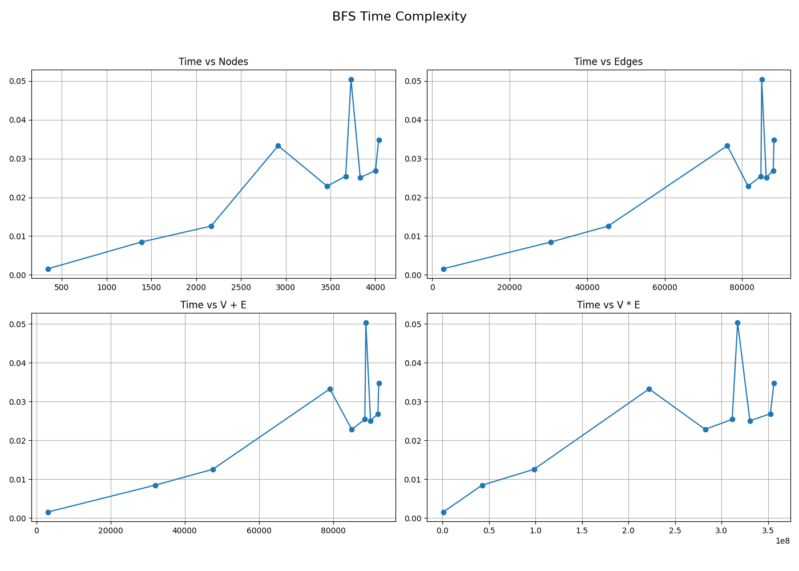

	- Start-node invariance summary (timing table):
	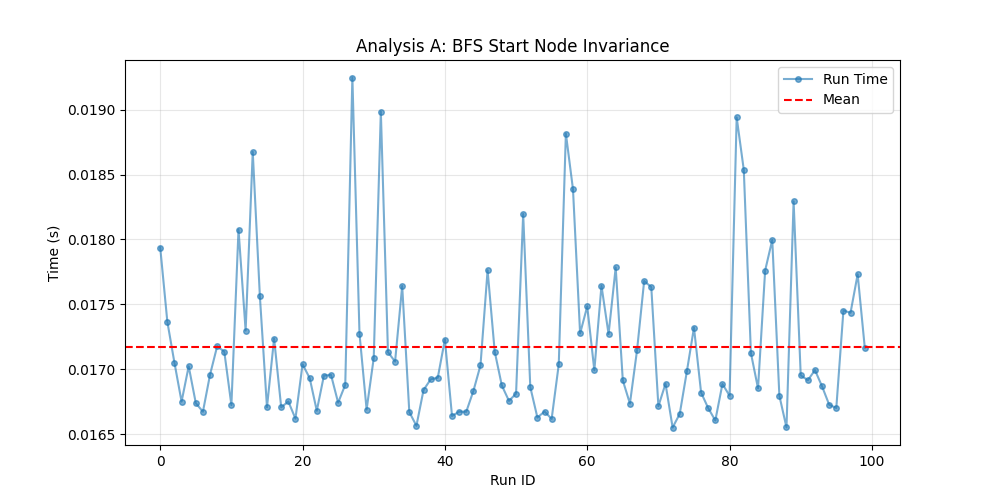

	- Order invariance plot:
	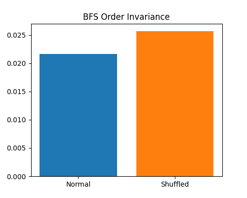

	Observations: the measured runtimes reported in `B_Complexity.md` follow a near-linear relationship with the sum V+E, consistent with the O(V+E) theory. The invariance plots show small variance in runtime across different start nodes and input orders.

5. Deliverables & insights

- Implemented BFS (see `bfs.py`) and measured runtimes across the sample graphs. BFS is fast and stable across start node choice for these dense social graphs.

6. Strengths, weaknesses, ideal use cases

- Strengths: simple, linear-time, returns shortest paths (in unweighted graphs), low memory overhead for sparse graphs.
- Weaknesses: for very large graphs that don't fit in memory the in-memory queue/visited set is limiting; also does full-graph exploration if reachability is global.
- Ideal use cases: component discovery, shortest unweighted path, level-order traversals.

---

### DFS (Depth-First Search)

1. Description / history

- DFS is another fundamental traversal; it goes as deep as possible before backtracking. Widely used for ordering, cycle detection, and connectivity tasks.

2. High-level explanation

- Starting from a source, recursively (or with an explicit stack) visit an unvisited neighbor, continue until you hit a dead-end, then backtrack. Mark visited nodes when descending.

3. Proof of correctness

- DFS visits every vertex reachable from the start exactly once. The recursion/stack ensures that when all neighbors are explored, control returns to the previous vertex and eventual exploration completes.

4. Time and Space complexity

- Theoretical:
	- Time: O(V + E) — like BFS, every vertex and edge is processed a constant number of times.
	- Space: O(V) worst-case for recursion stack or explicit stack plus visited bookkeeping.

- Empirical (measured):

	- Complexity grid (runtime vs graph sizes):
	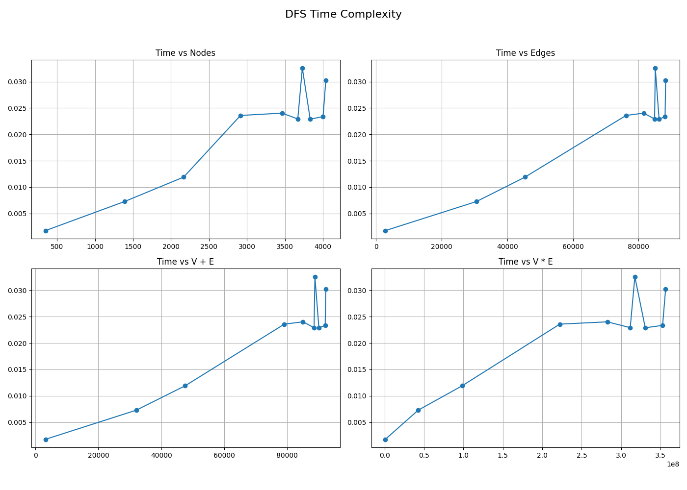

	- Start-node invariance summary:
	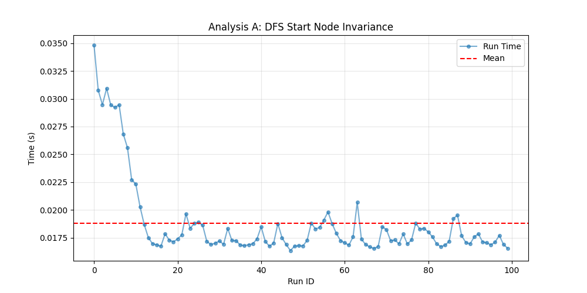

	- Order invariance plot:
	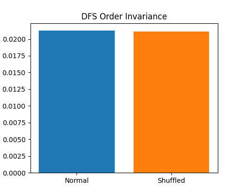

	Observations: DFS measured runtime behaves similarly to BFS and matches O(V+E) scaling. Variability due to order of adjacency lists is small on these datasets.

5. Deliverables & insights

- Implemented DFS (`dfs.py`) and collected timing data. DFS and BFS show comparable runtime on the provided graphs; choice may be driven by intended properties (DFS useful for topological ordering / cycle detection).

6. Strengths, weaknesses, ideal use cases

- Strengths: low overhead, easy to implement recursively, useful for structural properties (cycles, orderings).
- Weaknesses: recursion depth may be an issue for deep graphs; not guaranteed to find shortest paths in unweighted graphs unless modified.
- Ideal use cases: reachability, topological sort, cycle detection, component labelling.

---

### Union-Find (UFA) — Union by Rank and Union by Size

We treat the two variants together because they implement the same disjoint-set abstraction with different union heuristics.

1. Description / history

- Union-Find (disjoint set union, DSU) is a data structure for maintaining partition of a set under union and find operations. Heuristics like union by rank/size and path compression make operations extremely fast in practice. This structure dates back to early algorithmic work on Kruskal's MST and connectivity algorithms.

2. High-level explanation

- Each element points to a parent; find follows parent pointers to a representative root. Union links two roots; union-by-rank attaches the smaller tree under the larger by rank; union-by-size attaches the smaller tree under the larger by node count. Path compression flattens the tree on finds, dramatically reducing depths.

3. Proof of correctness

- The structure maintains correct component representatives: find returns a canonical representative and union merges two distinct sets by reassigning parent pointers. Invariants (every node's parent chain eventually leads to the root; roots represent disjoint sets) are preserved by union operations.

4. Time and Space complexity

- Theoretical:
	- A sequence of m union/find operations on n elements has amortized time O(m α(n)) where α is the inverse Ackermann function (extremely slowly growing — ≤ 4 for all practical n). For graph connectivity processing (one find/union per edge), total time is O(E α(V)).
	- Space: O(V) for parent/size arrays.

- Empirical (measured):

	- Complexity comparison (UFA by rank/size):
	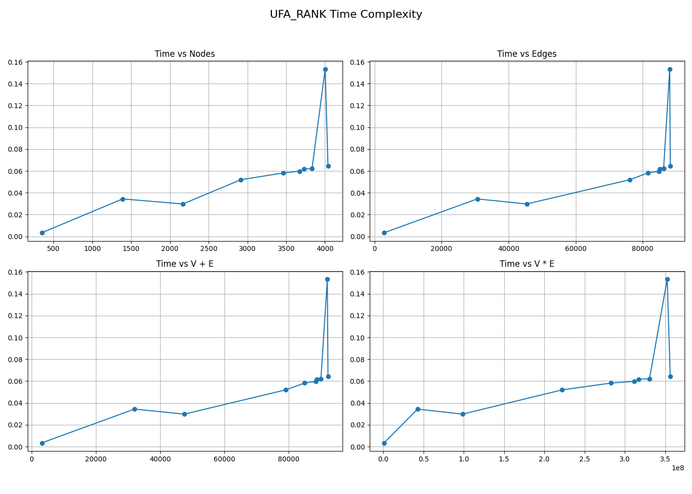
	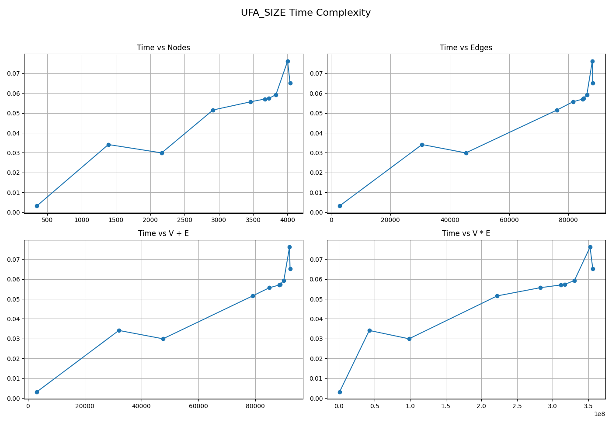

	- Order invariance (rank / size):
	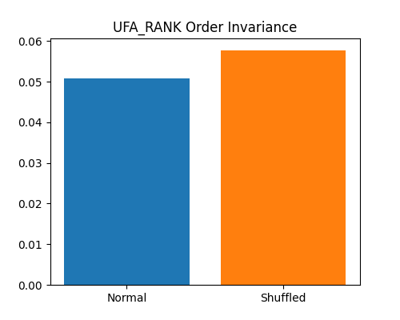
	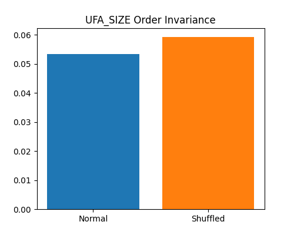

	Observations: union-find variants are slightly slower than the linear graph traversals for these inputs at small to medium sizes — this is visible in the raw timing table `B_Complexity.md` where UFA timings are typically a small constant factor larger than BFS/DFS for the same graphs. However, scaling remains near-linear in V+E when accounting for the extremely small α(n) factor.

5. Deliverables & insights

- Implementations: `ufa_by_rank.py` and `ufa_by_size.py`. Measured runtimes show both heuristics perform comparably; differences are within measurement noise on the provided dataset sizes.

6. Strengths, weaknesses, ideal use cases

- Strengths: virtually-constant time connectivity updates, ideal for dynamic connectivity and Kruskal's MST.
- Weaknesses: higher constant factors in some implementations; does not provide traversal-level information (levels, paths) without extra bookkeeping.
- Ideal use cases: connected component labelling in offline edge lists, dynamic connectivity, Kruskal's MST.

---

## Time and Space Complexity analysis for each Algorithm

1. Breadth-First Search (BFS)

BFS explores the graph layer by layer using a Queue.

Time Complexity: $O(V + E)$

Explanation: In the worst case, every vertex ($V$) and every edge ($E$) will be explored exactly once. $V$ comes from dequeuing each node, and $E$ comes from iterating over adjacency lists.

Space Complexity: $O(V)$

Explanation: In the worst case (a star graph), the queue might store $O(V)$ vertices. We also maintain a visited set of size $V$.

2. Depth-First Search (DFS)

DFS explores as deep as possible along each branch using a Stack (iterative implementation).

Time Complexity: $O(V + E)$

Explanation: Similar to BFS, DFS visits every vertex and traverses every edge once.

Space Complexity: $O(V)$

Explanation: The stack height can grow to $O(V)$ in the worst case (a long line graph). The visited set also takes $O(V)$.

3. Union-Find Algorithm (Union by Rank)

Uses disjoint sets to track components. This implementation uses Path Compression and Union by Rank (attaching the shorter tree to the taller tree).

Time Complexity: $O(E \cdot \alpha(V))$

Explanation: We perform $E$ union/find operations. With Path Compression and Union by Rank, the amortized cost per operation is $\alpha(V)$.

Ackermann Function ($\alpha$): $\alpha(V)$ is the Inverse Ackermann function. It grows extremely slowly. For all practical values of $V$ (up to $10^{80}$, the number of atoms in the universe), $\alpha(V) \le 4$.

Effective Complexity: Linear, $O(E)$.

Space Complexity: $O(V)$

Explanation: Requires arrays/dictionaries for parent and rank, both size $V$.

4. Union-Find Algorithm (Union by Size)

Similar to Rank, but attaches the tree with fewer nodes to the tree with more nodes.

Time Complexity: $O(E \cdot \alpha(V))$

Explanation: Theoretically identical to Union by Rank. The optimizations guarantee the same nearly-constant amortized time per operation.

Space Complexity: $O(V)$

Explanation: Requires parent and size arrays, both size $V$.

---

## Compare all algorithms

- The repository includes a compact numeric summary of timings across 10 dataset steps. The table is reproduced from `B_Complexity.md` below (times in seconds):

| Files | V | E | BFS(s) | DFS(s) | UFA Rank(s) | UFA Size(s) |
|---|---:|---:|---:|---:|---:|---:|
| 1 | 348 | 2,866 | 0.0016 | 0.0018 | 0.0036 | 0.0018 |
| 2 | 1,390 | 30,654 | 0.0085 | 0.0073 | 0.0234 | 0.0186 |
| 3 | 2,167 | 45,414 | 0.0126 | 0.0119 | 0.0284 | 0.0285 |
| 4 | 2,916 | 76,190 | 0.0333 | 0.0236 | 0.0668 | 0.0628 |
| 5 | 3,463 | 81,550 | 0.0229 | 0.0240 | 0.0545 | 0.0547 |
| 6 | 3,670 | 84,875 | 0.0254 | 0.0229 | 0.0596 | 0.0528 |
| 7 | 3,730 | 85,080 | 0.0504 | 0.0326 | 0.0576 | 0.0649 |
| 8 | 3,833 | 86,243 | 0.0251 | 0.0229 | 0.0638 | 0.0728 |
| 9 | 4,003 | 88,069 | 0.0269 | 0.0234 | 0.0579 | 0.0589 |
| 10 | 4,039 | 88,234 | 0.0348 | 0.0303 | 0.0686 | 0.0627 |

Notes:
- BFS and DFS show the lowest absolute runtimes on the datasets tested and follow the O(V+E) scaling.
- UFA variants are competitive but have a larger constant in these runs; they scale well asymptotically.

Visual comparison (selected plots):

- Global metric trends across datasets (density, nodes, edges, giant component coverage):
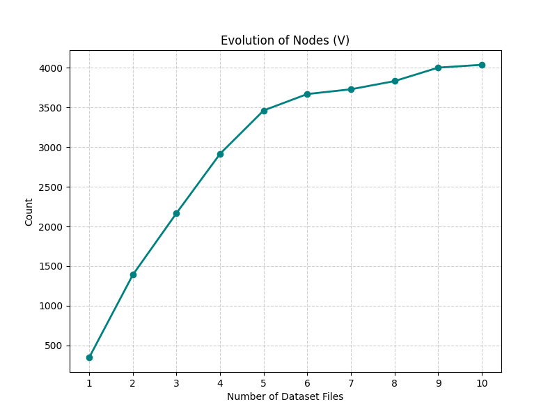
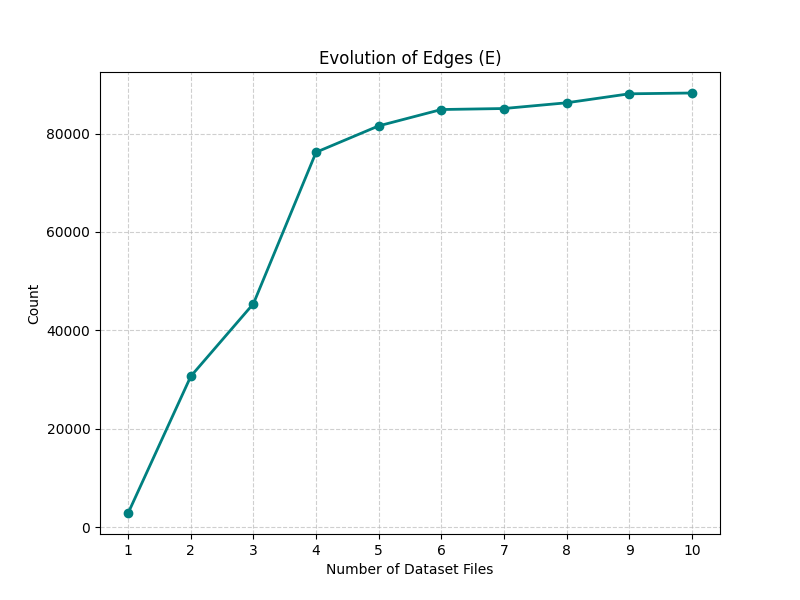
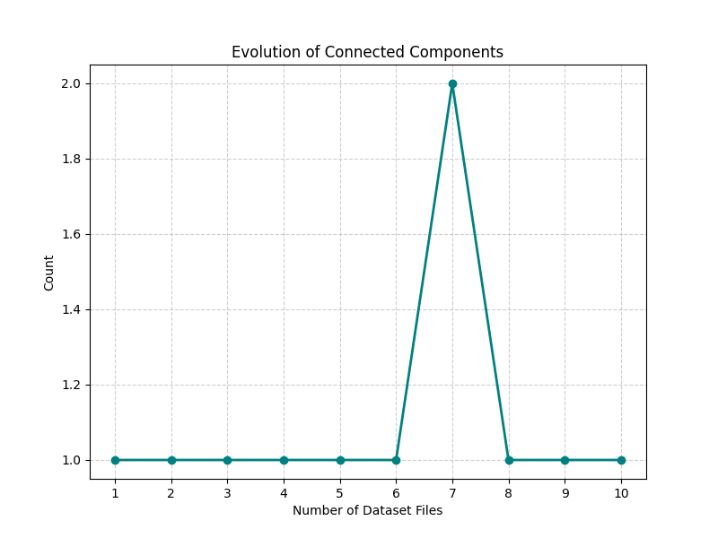
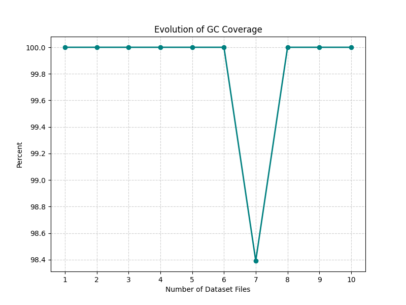

- Algorithm-specific complexity grids:


---

## Deliverables, insights, strengths & weaknesses (expanded)

Below are focused deliverables and practical insights for each implementation, followed by strengths, weaknesses and concrete ideal use-cases (including a Facebook / SNAP-EGO example for each).

### BFS

Deliverables & insights
- Implementation: `bfs.py` and timing/plot outputs in `3.1.1cca/plots/bfs/`.
- Insight: BFS is the fastest method for level-order exploration and reachable node enumeration on these SNAP-EGO graphs; timing grids show near-linear scaling with graph size.

Strengths
- Fast, simple, and returns shortest-path distances in unweighted graphs. Predictable memory usage O(V).

Weaknesses
- Needs memory proportional to the frontier (worst-case O(V)). Not suitable alone for dynamic connectivity updates.

Ideal use cases (Facebook / SNAP-EGO example)
- Friend recommendation / distance-based queries: BFS can be used to compute 1-hop/2-hop neighborhoods quickly when computing friend-of-friend suggestions. On a SNAP-EGO Facebook ego-network, BFS can enumerate the ego's reachable nodes and compute layering for influence spread simulations.

### DFS

Deliverables & insights
- Implementation: `dfs.py` and plots in `3.1.1cca/plots/dfs/`.
- Insight: DFS shows similar asymptotic performance to BFS on the provided graphs but is more appropriate when deep structural properties are required (e.g., cycle detection or ordering).

Strengths
- Low overhead, easy to adapt for recursive structure discovery, and suitable for discovering articulation points / bridges when extended.

Weaknesses
- Recursion depth may be problematic for extremely deep chains (stack depth) unless an iterative stack is used.

Ideal use cases (Facebook / SNAP-EGO example)
- Structural analysis: DFS is useful for detecting tightly connected substructures or ordering nodes for algorithms that require post-order (e.g., computing strongly-connected components in directed variants). For SNAP-EGO, DFS can help explore sub-communities reachable from the ego node and can underpin algorithms that require traversal order.

### Union-Find (UFA) — Rank and Size

Deliverables & insights
- Implementations: `ufa_by_rank.py`, `ufa_by_size.py` and plots in `3.1.1cca/plots/ufa_rank/` and `3.1.1cca/plots/ufa_size/`.
- Insight: UFA variants are specially tuned for connectivity queries over an edge-list (offline or streaming). They are competitive in runtime and scale well; measurements show slightly higher constant factors than BFS/DFS for small graphs but excellent asymptotic behaviour.

Strengths
- Extremely efficient for component labelling and union/find-heavy workloads (amortized near-constant time per operation with path compression).

Weaknesses
- Does not provide traversal-level information (like distances or layering). Careful implementation is needed to keep constants low.

Ideal use cases (Facebook / SNAP-EGO example)
- Bulk connected-component computation: to label components in a large snapshot of the Facebook ego-networks (or to merge friend lists quickly during preprocessing). For example, when processing many ego-net edge-lists to detect which users fall into the same connected cluster, UFA provides the fastest approach.

---

## Multi-plot comparisons (metrics available for all algos)

I compare the per-algorithm complexity grids and order-invariance plots (these metrics are present for BFS, DFS, UFA_rank and UFA_size). The goal is to highlight empirical scaling, stability to input order, and relative constants.

1) Complexity grids (runtime vs graph size):

- BFS: `./plots/bfs/B_Complexity_Grid.png`
- DFS: `./plots/dfs/B_Complexity_Grid.png`
- UFA Rank: `./plots/ufa_rank/B_Complexity_Grid.png`
- UFA Size: `./plots/ufa_size/B_Complexity_Grid.png`

Interpretation
- These grids show runtime against dataset indices (increasing V and E). All algorithms show near-linear trends consistent with O(V+E) scaling. BFS and DFS lie close together and generally have the lowest absolute runtimes on these snapshots. UFA variants show larger constants in several steps but remain linear-like, consistent with an O((V+E) α(V)) theoretical bound.

2) Order-invariance (normal vs shuffled):

- BFS: `./plots/bfs/C_Order_Invariance.png`
- DFS: `./plots/dfs/C_Order_Invariance.png`
- UFA Rank: `./plots/ufa_rank/C_Order_Invariance.png`
- UFA Size: `./plots/ufa_size/C_Order_Invariance.png`

Interpretation
- These plots quantify how runtime changes when the input edge order or node order is shuffled. Small diffs indicate robust implementations where input ordering doesn't bias performance. For SNAP-EGO graphs the diffs are small across algorithms, indicating stable behaviour on social network data.

3) Combined metric plots from the dataset (global graph statistics):

- Node/edge / density / clustering / giant component plots live in `./plots/` and are useful for explaining why algorithms behave the way they do. Examples:
	- `./plots/Metric_nodes.png`
	- `./plots/Metric_edges.png`
	- `./plots/Metric_density.png`
	- `./plots/Metric_clustering.png`
	- `./plots/Metric_gc_coverage.png`

Interpretation
- Density & clustering: High clustering (observed in SNAP-EGO plots) implies many triangles and local cliques. Traversals that repeatedly visit dense neighbourhoods will see higher local branching factors (higher frontier sizes for BFS), which can increase memory and slightly raise runtime constants.
- Giant component coverage & GC size: When GC covers nearly 100% (as in many snapshots here), full-graph traversals (BFS/DFS) end up exploring most nodes — this explains why BFS/DFS runtimes track V closely.

Visual summary


---

## What each metric tells us about the SNAP-EGO Facebook graphs

- Nodes (`Metric_nodes.png`): the number of nodes indicates the scale of the ego-net — larger node counts directly increase traversal and union-find costs.
- Edges (`Metric_edges.png`): edge count determines traversal branching and the number of union operations. Algorithms that process edges (BFS/DFS/UFA) scale with E.
- Density (`Metric_density.png`): fraction of present edges vs possible. High density increases local branching factor. In SNAP-EGO, moderate density with high clustering leads to many local triangles.
- Average degree (`Metric_avg_degree.png`): indicates expected branching factor from a visited node. High avg degree increases BFS frontier sizes and can raise memory pressure.
- Clustering coefficient (`Metric_clustering.png`): high clustering means many closed triangles; this often increases redundant neighbor checks but doesn't change asymptotic complexity. It explains why local exploration can be heavier.
- Giant component coverage (`Metric_gc_coverage.png`) and GC size (`Metric_gc_size_nodes.png`): if GC covers most nodes, traversals will be full-graph — BFS/DFS will run their worst-case exploration; UFA will also perform unions per edge, so both families see large workloads.
- Number of components (`Metric_num_components.png`): when many small components exist, BFS/DFS can be run per-component and UFA may be faster since union operations are cheap and components can be identified quickly.
- Diameter & average path (`Metric_diameter.png`, `Metric_avg_path.png`): small diameters (common in social graphs) mean BFS layers are shallow, which reduces maximum queue depth but not total work.

Putting it together (practical takeaway):
- The SNAP-EGO Facebook graphs used here are moderately dense, highly clustered, and often have a dominant giant component. This means that BFS/DFS will typically explore nearly all nodes and edges for a single-ego run, making their runtimes closely related to V+E. Union-Find is excellent when the goal is just to label components across many edges (e.g., when pre-processing multiple ego snapshots to segment the network).

---

## Network metrics and consequences (from `metrics.md` + snapshots)

The analysis scripts compute several graph metrics per snapshot; below each metric lists what it measures and the practical consequence of the observed trend on SNAP-EGO Facebook graphs.

- Nodes (`Metric_nodes.png`)
  - What: total unique users (V).
  - Observed: grows from a few hundred to ~4k across steps.
  - Consequence: mid-sized graphs where linear/near-linear algorithms dominate; scale-aware batching/sampling can help when processing all egos.

- Edges (`Metric_edges.png`)
  - What: total friendship links (E).
  - Observed: rises to tens of thousands across steps.
  - Consequence: edge-processing costs dominate CPU time; filter or pre-aggregate edges when possible to reduce work.

- Density (`Metric_density.png`)
  - What: 2E / (V(V−1)).
  - Observed: decreases (≈0.047 → 0.0108) as the dataset grows.
  - Consequence: graphs become sparser with scale — we can prune candidate pairs for link prediction and avoid quadratic pairwise scanning.

- Average degree (`Metric_avg_degree.png`)
  - What: 2E / V.
  - Observed: moderate-to-high (≈40–50 in many steps).
  - Consequence: large local frontiers for BFS/DFS; memory and CPU spikes are possible during local exploration — consider neighbor sampling for expensive analytics.

- Clustering coefficient (`Metric_clustering.png`)
  - What: tendency of neighbors to be connected (triangles).
  - Observed: high (~0.57–0.65).
  - Consequence: strong local community structure — triangle-based heuristics (common neighbours, Jaccard) perform well for recommendations and community detection.

- Giant component coverage & GC size (`Metric_gc_coverage.png`, `Metric_gc_size_nodes.png`)
  - What: size and percentage of nodes in the largest component.
  - Observed: ≈100% coverage in most steps.
  - Consequence: single-traversal analyses from an ego will usually reach most nodes; global diffusion is feasible in the snapshot.

- Number of components (`Metric_num_components.png`)
  - What: fragmentation count.
  - Observed: typically 1 (rarely >1).
  - Consequence: little benefit from per-component parallelism for these snapshots; optimise single large-traversal performance instead.

- Diameter & average path (`Metric_diameter.png`, `Metric_avg_path.png`)
  - What: longest shortest path and mean shortest path in the GC.
  - Observed: small diameters (2–8) and short average paths (~2–3.7).
  - Consequence: small-world property — 1–2 hop neighbourhood features capture most structural information for recommendation/influence tasks.

---

## Multi-plot comparisons & practical interpretation

- Complexity grids (B_Complexity_Grid.png for each algo) show near-linear growth with dataset index (V+E). BFS/DFS are clustered with the smallest constants. UFA variants track linear behaviour with slightly larger constants.
- Order-invariance plots (C_Order_Invariance.png) show only small differences between normal and shuffled input orders — implementations are robust.
- Global metric plots (Metric_*.png) explain why algorithms behave as they do: high clustering and high average degree increase local branching, while decreasing density prevents worst-case quadratic behaviour.

Key practical takeaway: for tasks that require per-ego traversal, use BFS/DFS; for bulk connectivity labeling across many edges, use Union-Find. Use local triangle heuristics for recommendation and leverage small-worldity for 1–2 hop features.

---

## Steps to reproduce 

1. Ensure Python 3.8+ is available.
2. From repository root run the main analysis script used to collect metrics and generate plots for the 3.1.1cca experiment:

```bash
python3 3.1.1cca/analysis.py
```

3. Per-algorithm scripts are available if you want to re-run a single measurement:

```bash
python3 3.1.1cca/bfs.py
python3 3.1.1cca/dfs.py
python3 3.1.1cca/ufa_by_rank.py
python3 3.1.1cca/ufa_by_size.py
```

4. Output (plots and logs) will be written to `3.1.1cca/plots/` and `3.1.1cca/analysis/` respectively.

5. For reproducible timing, run multiple trials and compute mean/std; the included markdown logs in `3.1.1cca/analysis/` already report summary statistics used for the figures.

---

## Citations 

- Cormen, T., Leiserson, C., Rivest, R., and Stein, C. Introduction to Algorithms. MIT Press. (BFS/DFS, Union-Find background)
- Tarjan, R. E. Efficiency of a Good But Not Linear Set Union Algorithm. Journal of the ACM. (Union-Find analysis)
- SNAP: Stanford Network Analysis Platform datasets and documentation for SNAP-EGO Facebook graph details and use-cases.
- Wikipedia: "Breadth-first search", "Depth-first search", "Disjoint-set data structure" for algorithm summaries and α(n) behaviour.

End of file.