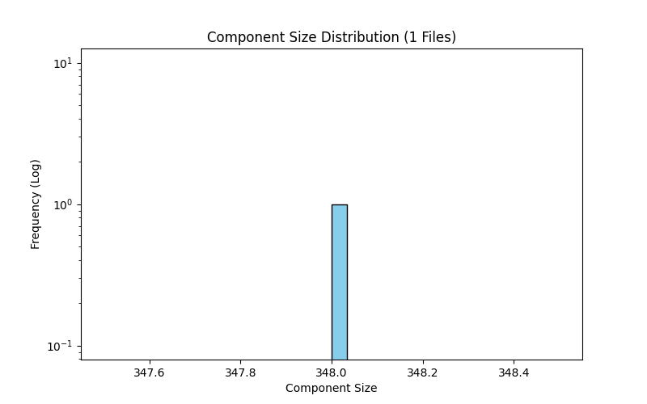

# Connected Components Analysis: 1 File(s)

- **Total Nodes:** 348
- **Total Edges:** 2,866
- **Total Components:** 1

## Giant Component (GC)
- **Nodes:** 348
- **Edges:** 2,866
- **Coverage:** 100.00% of graph

## Component Distribution

