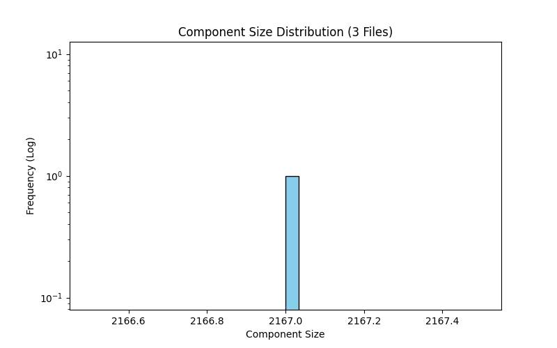

# Connected Components Analysis: 3 File(s)

- **Total Nodes:** 2,167
- **Total Edges:** 45,414
- **Total Components:** 1

## Giant Component (GC)
- **Nodes:** 2,167
- **Edges:** 45,414
- **Coverage:** 100.00% of graph

## Component Distribution

