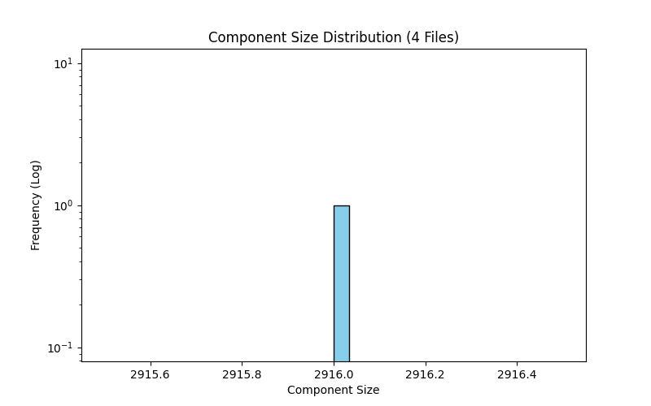

# Connected Components Analysis: 4 File(s)

- **Total Nodes:** 2,916
- **Total Edges:** 76,190
- **Total Components:** 1

## Giant Component (GC)
- **Nodes:** 2,916
- **Edges:** 76,190
- **Coverage:** 100.00% of graph

## Component Distribution

