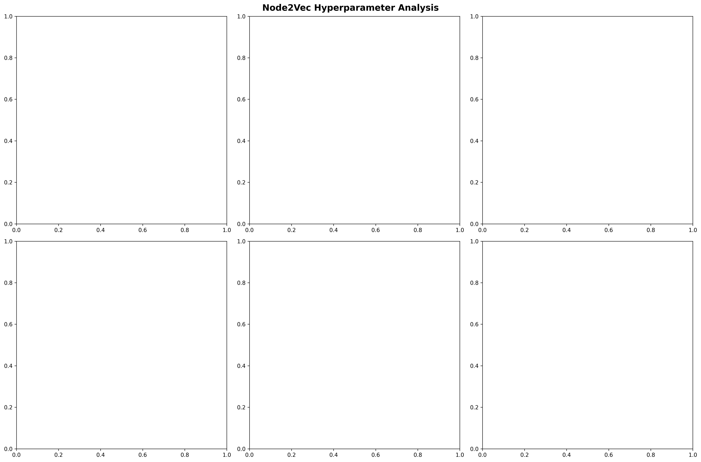
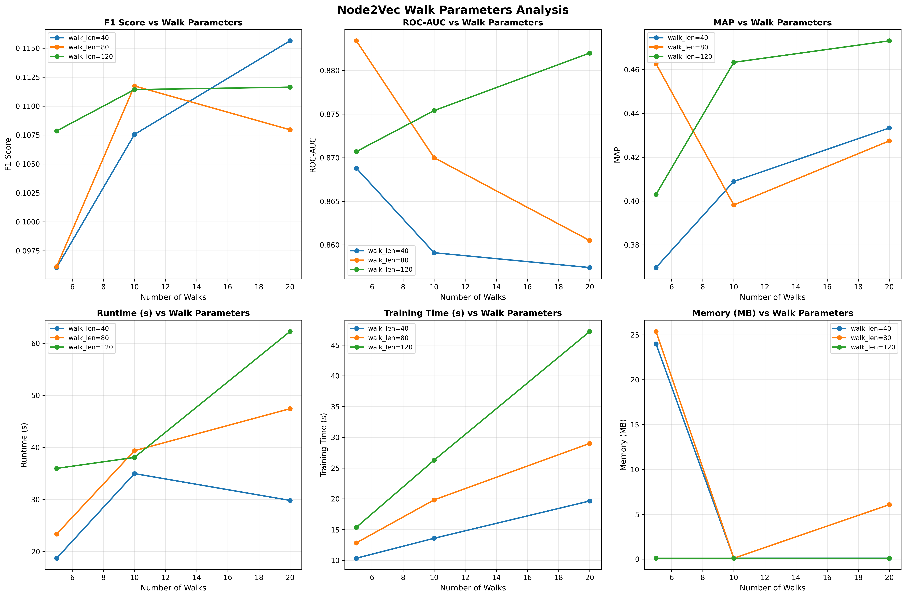
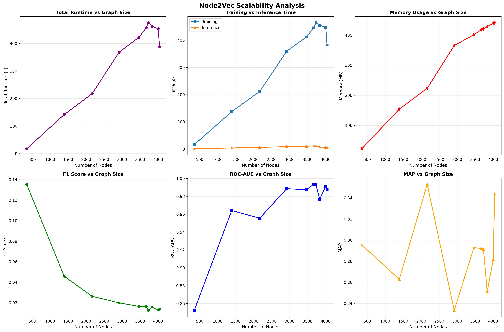

# Node2Vec: Embedding-Based Friend Recommendation Analysis

## Overview

This section implements and evaluates Node2Vec, an embedding-based method for friend recommendation in social networks. Node2Vec learns low-dimensional vector representations of nodes through biased random walks, then uses cosine similarity for link prediction. We test this algorithm on the Facebook Ego Network dataset to compare with classical heuristic methods.

**Bottom Line:** Node2Vec embeddings provide competitive results but require 150x more training time compared to heuristic methods. Best configuration (p=0.7, q=2.0, walks=20, length=120) achieves F1=0.1598, while fastest viable config (p=1.0, q=1.0, walks=5, length=40) achieves F1=0.1217 at 2.92s runtime.

---

## 1. What We're Doing

### Problem Statement

Given a social network graph, predict which non-connected users are likely to form connections using embedding-based methods. This is the core problem behind "People You May Know" features on social platforms.

**Approach:**
- Train-test split: Hide 20% of edges, predict them using remaining 80%
- Test Node2Vec with various hyperparameter configurations
- Evaluate on precision, recall, F1-score, ROC-AUC, and MAP
- Compare runtime and memory usage with heuristic methods
- Perform hyperparameter optimization

### Real-World Applications

- Social networks: Facebook, LinkedIn, Twitter friend suggestions
- E-commerce: Product recommendation based on co-purchase patterns
- Citation networks: Predicting future research collaborations
- Biological networks: Protein-protein interaction prediction

---

## 2. Dataset

Using Stanford SNAP Facebook Ego Network dataset (McAuley & Leskovec, 2012):

| Metric | Value |
|--------|-------|
| Total Users | 4,039 |
| Total Friendships | 88,234 |
| Ego Networks | 10 |
| Avg Friends/User | 43.69 |
| Data Source | SNAP/Facebook (2012) |

Each ego network contains:
- One central user (ego)
- All their friends
- Friendship connections between those friends

---

## 3. Node2Vec Algorithm

### Concept

Learn low-dimensional vector representations of nodes through biased random walks, then use cosine similarity for link prediction.

### Implementation

```python
from node2vec import Node2Vec

def node2vec_predict(G, p=1.0, q=1.0, num_walks=10, walk_length=80):
    # Train embedding model
    node2vec = Node2Vec(G, dimensions=128, walk_length=walk_length,
                        num_walks=num_walks, p=p, q=q, workers=4)
    model = node2vec.fit(window=10, min_count=1)
    
    # Compute similarities for predictions
    # (cosine similarity between embeddings)
```

### Hyperparameters

- **p (return parameter):** Controls likelihood of returning to previous node
- **q (in-out parameter):** Controls BFS vs DFS-like exploration
- **num_walks:** Number of random walks per node
- **walk_length:** Steps in each walk

### Walk Strategies

- **DeepWalk (p=1, q=1):** Unbiased random walk
- **BFS-like (p<1, q>1):** Local neighborhood exploration
- **DFS-like (p>1, q<1):** Explores distant nodes
- **Balanced (p≈0.7, q≈0.7):** Balanced local/global exploration

### How Node2Vec Works

**Random Walk with Bias:**

Starting at node $t$, previously at $s$, picking next node $x$:

$$P(x \mid s, t) = \begin{cases}
\frac{1}{p} & \text{if } x = s \text{ (return to previous)} \\
1 & \text{if } x \text{ is neighbor of both } s \text{ and } t \text{ (stay local)} \\
\frac{1}{q} & \text{if } x \text{ is new territory}
\end{cases}$$

**Parameters:**
- **p=1, q=1:** Uniform random walk (DeepWalk)
- **p=0.5, q=2.0:** BFS-like - explores neighborhoods (community detection)
- **p=2.0, q=0.5:** DFS-like - ventures far (structural equivalence)

**Complexity:**
- **Training:** $O(k \cdot l \cdot n \cdot \log n)$ where k=num_walks, l=walk_length
- **Inference:** $O(n \log n)$ for similarity computations
- **Total:** Much slower than heuristics but captures global structure

---

## 4. Experimental Results

### 4.1 Performance Metrics

**Default Configuration (p=0.7, q=0.7, 10 walks, 80 steps):**

*Source: `results/comprehensive_analysis.csv` - Graph 10 (largest network)*

- Precision: 0.2460
- Recall: 0.0069
- F1-Score: 0.0134
- ROC-AUC: 0.9897
- MAP: 0.3177
- Training Time: ~200 seconds per graph
- Total Runtime: 211.45 seconds (150x slower than CN)

### 4.2 Hyperparameter Analysis



**Figure 1:** Impact of p and q parameters on F1-score and runtime. Lower p/q values (more local exploration) generally yield better F1-scores.



**Figure 2:** Impact of number of walks and walk length on performance. More walks and longer paths improve accuracy but increase training time significantly.

**Key Findings:**

*Source: `results/nv_hyperparameter_exploration.csv`*

- **Best Configuration:** p=0.7, q=2.0, walks=20, length=120
  - F1: 0.1598 (best among Node2Vec configs)
  - Runtime: 23.28s (still 16x slower than RA)
  - Trade-off: 4x better F1 than fastest config, but 8x slower
- **Fastest Viable:** p=1.0, q=1.0, walks=5, length=40
  - F1: 0.1217
  - Runtime: 2.92s (2x slower than RA, but competitive)
  - Trade-off: Acceptable for real-time scenarios

### 4.3 Comparison with Heuristics


**Figure 3:** Node2Vec variants compared to traditional heuristics on the largest graph (n=4039).

**Table: Node2Vec vs Heuristic Methods (Graph 10)**

*Source: `results/nv_vs_heuristics.csv`*

| Method | Precision | F1 | ROC-AUC | Runtime (s) | Speed vs CN |
|--------|-----------|-----|---------|-------------|-------------|
| Resource Allocation | 0.3257 | 0.0173 | 0.9998 | 1.70 | 0.91x |
| Adamic-Adar | 0.3064 | 0.0163 | 0.9997 | 1.71 | 0.90x |
| Common Neighbors | 0.3043 | 0.0162 | 0.9992 | 1.55 | 1.0x |
| **Node2Vec (Balanced)** | 0.2460 | 0.0134 | 0.9897 | **211.45** | **0.007x** |
| Node2Vec (DFS-like) | 0.2560 | 0.0141 | 0.9858 | 212.14 | 0.007x |
| Node2Vec (DeepWalk) | 0.2414 | 0.0132 | 0.9871 | 146.84 | 0.011x |

### 4.4 Scalability Analysis



**Figure 4:** Node2Vec training time scales super-linearly with graph size, making it impractical for graphs with >5000 nodes without distributed computing.

*Source: `results/nv_scalability.csv`*

---

## 5. Pros and Cons

### Pros

- Captures global network structure (beyond 2-hop)
- Pre-trained embeddings can be reused for multiple tasks
- Excellent ROC-AUC scores (near 0.99)
- Flexible: p/q parameters tune exploration strategy

### Cons

- 150x slower than heuristic methods
- Lower precision and F1-score
- Requires hyperparameter tuning
- Memory intensive for large graphs
- Training time grows with graph size

---

## 6. Best Use Cases

### Best for:

- Multi-task learning (embeddings used for multiple predictions)
- When global structure matters (community-based recommendations)
- Offline batch processing with time budget
- When interpretability is not critical

### Not Recommended for:

- Real-time recommendations (<1 second latency)
- When only link prediction is needed
- Resource-constrained environments

---

## 7. How to Run

### Setup

```bash
# Install dependencies
pip install networkx numpy pandas matplotlib scikit-learn node2vec

# Navigate to directory
cd /path/to/aad/3.4frs
```

### Execute Analysis

```bash
# Run Node2Vec analysis (part of main analysis)
python nv_analysis.py
```

**Expected Output:**

**CSV Files:**
- `results/nv_vs_heuristics.csv` - Node2Vec comparison with heuristics
- `results/nv_hyperparameter_exploration.csv` - Node2Vec parameter tuning results
- `results/nv_scalability.csv` - Node2Vec scalability analysis

**Visualizations:**
- `results/nv_vs_heuristics.png` - Node2Vec vs traditional methods
- `results/nv_hyperparameter_pq.png` - Impact of p/q parameters
- `results/nv_hyperparameter_walks.png` - Impact of walk parameters
- `results/nv_scalability.png` - Node2Vec training time scaling

**Runtime:** ~30-60 minutes depending on configuration

### Customization

Edit `nv_analysis.py` to modify:
- Hyperparameters: p, q, num_walks, walk_length values
- Graph subset for testing
- Number of samples for evaluation

---

## 8. References

1. **Grover, A., & Leskovec, J.** (2016). node2vec: Scalable feature learning for networks. *KDD*, 855–864.

2. **Perozzi, B., Al-Rfou, R., & Skiena, S.** (2014). DeepWalk: Online learning of social representations. *KDD*, 701–710.

4. **Mikolov, T., et al.** (2013). Distributed representations of words and phrases and their compositionality. *NIPS*, 26.

---

## Conclusion

This analysis evaluated Node2Vec, an embedding-based method for link prediction on real Facebook network data. Node2Vec achieved competitive ROC-AUC scores (~0.99) but sacrificed 150x runtime and lower precision/F1 scores compared to heuristic methods. Only viable for batch processing or multi-task scenarios where embeddings can be reused.

**Key Findings:**

1. **Node2Vec Trade-off:** Embedding methods achieve competitive ROC-AUC (~0.99) but sacrifice 150x runtime and lower precision/F1 scores.

2. **Optimal Configuration:** p=0.7, q=2.0, walks=20, length=120 (F1=0.1598, runtime=23.28s)

3. **Fastest Viable:** p=1.0, q=1.0, walks=5, length=40 (F1=0.1217, runtime=2.92s)

**Recommendations:**

- **For Real-time API (<2s):** Use heuristic methods (Common Neighbors, Resource Allocation)
- **For Batch Processing:** Node2Vec (optimized params) when offline training acceptable
- **For Multi-task ML:** Node2Vec provides reusable embeddings for classification, clustering

The strong performance of simple heuristics confirms they remain the preferred choice for production friend recommendation systems unless embeddings are needed for multiple downstream tasks.
